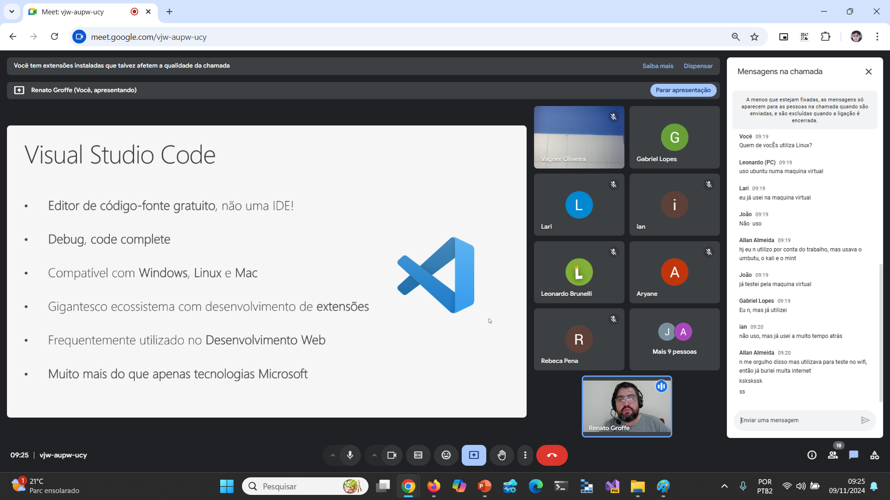

# Nuvem-IA-Mercado_2024-11
Conteúdos da apresentação "Nuvem/Cloud Computing em 2024 - Primeiros passos, Azure, Containers, Inteligência Artificial, tecnologias, carreira...". Talk realizada em **09/11/2024 (sábado)** para alunos da **Turma 1001** do [**Centro Universitário UniRuy - Wyden**](https://www.wyden.com.br/unidades/uniruy).

Palestrante: Renato Groffe - **Microsoft MVP, Docker Captain, MTAC**

Agradecimentos ao **Prof. Vagner Oliveira** pelo convite e por todo o apoio na realização desta palestra.

Número de participantes: **20 pessoas (pico de audiência ao longo da live)**

Tecnologias e tópicos abordados: **Cloud Computing, DevOps, Containers, Open Source, Cloud Native Docker, Kubernetes, Microsoft Azure, GitHub Copilot, OpenAI, Linux, Azure DevOps, GitHub**

---

Prints da apresentação

